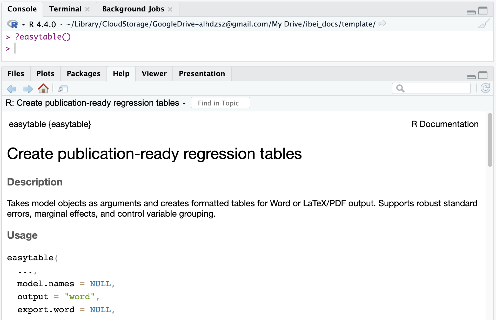

```{r}
library(knitr)
library(kableExtra)
library(easytable)

mtcars_tbl <- data.frame(
  modelo = rownames(mtcars),
  mtcars,
  row.names = NULL,
  check.names = FALSE
)
mtcars_tbl$transmision <- ifelse(mtcars_tbl$am == 1, "Manual", "Automática")

mod_simple <- lm(mpg ~ wt, data = mtcars_tbl)
mod_intermedio <- lm(mpg ~ wt + hp, data = mtcars_tbl)
mod_multiple <- lm(mpg ~ wt + hp + cyl + am, data = mtcars_tbl)

pred_simple <- mtcars_tbl
pred_simple$y_hat <- predict(mod_simple)
pred_simple$residuo <- resid(mod_simple)

pred_multiple <- mtcars_tbl
pred_multiple$y_hat_mult <- predict(mod_multiple)

coef_tab <- function(modelo) {
  s <- summary(modelo)
  data.frame(
    termino = rownames(s$coefficients),
    estimado = s$coefficients[, 1],
    error_std = s$coefficients[, 2],
    t = s$coefficients[, 3],
    p_valor = s$coefficients[, 4],
    row.names = NULL,
    check.names = FALSE
  )
}

stats_tab <- function(modelo, etiqueta) {
  s <- summary(modelo)
  data.frame(
    modelo = etiqueta,
    observaciones = length(modelo$fitted.values),
    r2 = s$r.squared,
    r2_ajustado = s$adj.r.squared,
    error_residual = s$sigma,
    f = unname(s$fstatistic[1]),
    gl1 = unname(s$fstatistic[2]),
    gl2 = unname(s$fstatistic[3]),
    aic = AIC(modelo),
    row.names = NULL,
    check.names = FALSE
  )
}

render_kbl <- function(df, 
                       digits = 2, 
                       height = "500px", 
                       font_size = 18, 
                       caption = NULL) {
  align_vec <- c("l", rep("r", max(0, ncol(df) - 1)))
  kbl(
    df,
    format = "html",
    digits = digits,
    align = align_vec,
    caption = caption
  ) |>
    kable_styling(
      full_width = TRUE,
      bootstrap_options = c("striped", "hover", "condensed"),
      font_size = font_size
    ) |>
    scroll_box(width = "100%", height = height)
}
```

## Objetivo de la sesión

-   Entender los componentes básicos de un modelo OLS.
-   Calcular e interpretar coefficientes $\beta$.
-   Entender por qué importan los controles (regresión múltiple).
-   Leer tablas de regresión con resultados reales en `mtcars`.

## Datos de trabajo: `mtcars`

> `mtcars` proviene de la revista Motor Trend (EE. UU., 1974) y contiene información sobre el consumo de combustible y diez características de diseño y desempeño de 32 automóviles de los modelos 1973–74. Tiene 32 observaciones y 11 variables numéricas, ampliamente utilizado en análisis estadístico y ejemplos en R.

<br>

```{r}
#| echo: true
#| message: false
#| results: 'hide'
#| warning: false

data(mtcars)
```


## Variables `mtcars`

<br>

<div style="font-size:50pt;">

| Variable | Descripción                              |
|----------|------------------------------------------|
| mpg      | Millas por galón (EE. UU.)               |
| cyl      | Número de cilindros                      |
| disp     | Cilindrada (pulgadas cúbicas)            |
| hp       | Caballos de fuerza brutos                |
| drat     | Relación del eje trasero                 |
| wt       | Peso (miles de libras)                   |
| qsec     | Tiempo en 1/4 de milla                   |
| vs       | Motor (0 = en V, 1 = en línea)           |
| am       | Transmisión (0 = automática, 1 = manual) |
| gear     | Número de marchas hacia adelante         |
| carb     | Número de carburadores                   |

</div>

## `mtcars`

<br>

```{r}
#| echo: false
#| message: false
#| warning: false

kbl(mtcars, digits = 1) %>% kable_styling(font_size = 25)

```

## Regresión lineal simple

$$
mpg_i = \beta_0 + \beta_1 wt_i + \epsilon_i
$$

-   Variable dependiente: `mpg`.
-   Variable independiente: `wt` (peso del auto).
-   Interpretación esperada: a mayor peso, menor rendimiento.

## Resultados del modelo simple

<br>

```{r}
#| echo: false
#| message: false
#| warning: false

m1 <- lm(mpg ~ wt, 
         data = mtcars)
summary(m1)
```


## ¿Qué son los residuales?

El residual es la diferencia entre el valor observado y el valor
predicho por el modelo:

$$
e_i = y_i - \hat{y}_i
$$

-   Residual positivo: el modelo subestimó.
-   Residual negativo: el modelo sobreestimó.


## Sesgo por variable omitida

<br>

-   Ocurre cuando excluimos una variable relevante para `mpg`.
-   Dos condiciones clásicas:
    -   La variable omitida afecta `mpg`.
    -   La variable omitida está correlacionada con un predictor
        incluido.
-   Consecuencia: coeficientes sesgados e inferencias engañosas.


## Supuestos de OLS

<br>

-   Relación lineal entre predictores y variable dependiente.
-   Errores con media cero.
-   Independencia de errores.
-   Homocedasticidad.
-   Ausencia de colinealidad severa (en modelos múltiples).


## Regresión múltiple

<br>

$$
mpg_i = \beta_0 + \beta_1 wt_i + \beta_2 hp_i + \beta_3 cyl_i + \beta_4 am_i + \epsilon_i
$$

-   Ahora controlamos simultáneamente por potencia, cilindros y
    transmisión.
-   Cada coeficiente se interpreta **ceteris paribus**.

## Interpretación de coeficientes

<br>

Con el modelo múltiple:

-   Efecto de `wt`: `r round(coef(mod_multiple)["wt"], 3)` unidades de
    `mpg` por cada unidad adicional de peso, manteniendo lo demás
    constante.
-   Efecto de `hp`: `r round(coef(mod_multiple)["hp"], 3)` sobre `mpg`,
    ceteris paribus.
-   Efecto de `am` (manual=1): `r round(coef(mod_multiple)["am"], 3)`
    frente a automática.

## Resultados del modelo múltiple

<br>

```{r}
#| echo: false
#| message: false
#| warning: false

m3 <- lm(mpg ~ wt + hp + cyl + am, data = mtcars)

summary(m3)
```


## Sintaxis Básica en R

<br>

```{r echo=TRUE, eval=TRUE}

# Modelo simple
m1 <- lm(mpg ~ wt, 
         data = mtcars)

# Modelo múltiple 
m2 <- lm(mpg ~ wt + hp, data = mtcars)

# Modelo múltiple 
m3 <- lm(mpg ~ wt + hp + cyl + am, data = mtcars)

```

# Tablas con `easytable`

## Instalar `easytable`

<br>

```{r echo=TRUE, eval=FALSE}
# Instalacion de un paquete de apoyo (dependencia)
install.packages("devtools")

# Instalacion de easytable
devtools::install_github("alfredo-hs/easytable")

# Activar easytable
library(easytable) 
```

## `easytable()` vs `summary()`

::::: columns
::: {.column width="50%"}
```{r echo=TRUE, eval=TRUE}
# Activar la función summary() sobre el objecto m1
summary(m1)
```
:::

::: {.column width="50%"}
```{r echo=TRUE, eval=TRUE}
# Activar la función easytable() sobre el objecto m1
easytable(m1)
```
:::
:::::

## Comparar modelos con `easytable()`

<br>

```{r echo=TRUE, eval=TRUE}
# Activar la función easytable() sobre los objectos m1 y m2
easytable(m1, m2)
```

## Otras funciones de `easytable()`

[{width="775"}](https://alfredo-hs.github.io/easytable/articles/penguins-tutorial.html)

## Otras funciones de `easytable()`

::::: columns
::: {.column width="50%"}
```{r echo=TRUE, eval=TRUE}
# Resaltar coeficientes significativos
easytable(m1, m2, m3,
          highlight = TRUE)
```
:::

::: {.column width="50%"}
```{r echo=TRUE, eval=TRUE}
# Nombrar modelos
easytable(m1, m2, m3,
          model.names = c("A", "B", "C"),
          highlight = TRUE)
```
:::
:::::

## Exportar a word

<br>

::::: columns
::: {.column width="50%"}
```{r echo=TRUE, eval=TRUE}
# Variables de control
easytable(m1, m2, m3,
          control.var = c("cyl", "am"),
          highlight = TRUE)
```
:::

::: {.column width="50%"}
```{r echo=TRUE, results='hide', eval=TRUE}
# Exportar a word y csv
easytable(m1, m2, m3,
          control.var = c("cyl", "am"),
          model.names = c("A", "B", "C"),
          export.word = "tabla.docx",
          export.csv = "tabla.csv",
          highlight = TRUE)
```
:::
:::::

## Resumen

<br>

```{r echo=TRUE, results='hide', eval=FALSE}
library(easytable)

# Modelos
m1 <- lm(mpg ~ wt, data = mtcars)
m2 <- lm(mpg ~ wt + hp, data = mtcars)
m3 <- lm(mpg ~ wt + hp + cyl + am, data = mtcars)

# Table
easytable(m1, m2, m3,
          control.var = c("cyl", "am"),
          model.names = c("A", "B", "C"),
          export.word = "tabla.docx",
          export.csv = "tabla.csv",
          highlight = TRUE)
```


# Thank you for your attention!

#  {background-image="about_bg.svg" background-size="cover" background-position="center"}

```{=html}
<script src="https://cdn.jsdelivr.net/npm/bsky-embed@0.0.5/dist/bsky-embed.es.js" async></script>

<style>
  .f-outer-container {
    display: flex;
    flex-direction: column;
    align-items: center;
    margin-top: 0;
    transform: translateY(-30px);
  }

  .f-title {
    font-size: 1.5rem;
    font-weight: bold;
    margin-bottom: 20px;
    text-align: center;
  }

  .bsky-disclaimer-container {
    display: flex;
    justify-content: center;
    align-items: stretch; /* let children define their height */
    gap: 40px;
    flex-wrap: wrap;
    width: 100%;
  }

  .bsky-section {
    background-color: #ffffff;
    padding: 10px;
    border: 1px solid lightgray;
    border-radius: 12px;
    box-shadow: 0 2px 4px rgba(0, 0, 0, 0.05);
    width: 40%;
    font-size: 0.7rem;
    display: flex;
    flex-direction: column;
    align-items: center;
    justify-content: center;
    gap: 10px;
  }

  .disclaimer-wrapper {
    width: 45%;
    display: flex;
    align-items: top;
  }

  .disclaimer-section {
    font-size: 1.2rem;
    line-height: 1.4;
    text-align: left;
  }

  .bsky-follow-btn {
    display: inline-block;
    padding: 8px 14px;
    font-size: 0.8rem;
    font-weight: 600;
    color: #ffffff;
    background: #0e314e;
    border: 1px solid #0e314e;
    border-radius: 999px;
    text-decoration: none;
    letter-spacing: 0.2px;
  }

  .bsky-follow-btn:hover {
    background: #2d8cff;
    border-color: #2d8cff;
    color: #ffffff;
    text-decoration: none;
  }
</style>

<div class="f-outer-container">
  <div class="bsky-disclaimer-container">
    <div class="bsky-section" id="firsa-eu.bsky-container">
      <bsky-embed  
        username="alfredohs.com"  
        limit="1"  
      ></bsky-embed>
      <a class="bsky-follow-btn" href="https://bsky.app/profile/alfredohs.com" target="_blank" rel="noopener">Follow me on Bluesky</a>
    </div>

    <div class="disclaimer-wrapper">
      <div class="disclaimer-section">
        <strong>About Me</strong>
        <br><br>
        I am a computational social scientist examining how ideas and narratives shape political and financial systems. Alongside research, I have taught several courses on data science for social scientists and regularly share and review open-source tools.
        <br><br> 
        For information more visit my <a href="https://alfredohs.com/" target="_blank">personal website</a>.
        <br><br>
        <div style="text-align: center;">
          
        </div>        
      </div>
    </div>
  </div>
</div>
```

## References

<br>

